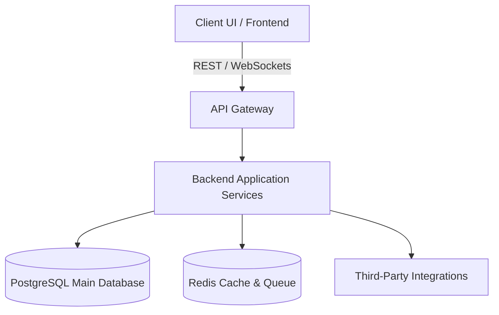

# BusinessFlow ERP 🚀

BusinessFlow ERP is a modern, scalable, and modular Enterprise Resource Planning (ERP) system designed to streamline and automate business processes across organization departments.

---

## 📂 Project Structure

The project is structured as a multi-repository monorepo style to separate concerns and modularize backend services, frontend applications, deployment infrastructure, and documentation:

```text
BusinessFlow-ERP/
│
├── docs/                      # Architectural, design, and project documentation
│   ├── SRS.md                 # Software Requirements Specification
│   ├── Architecture.md        # System Architecture & Technical stack design
│   ├── API-Design.md          # API endpoints, payloads, and protocols
│   ├── Database.md            # Schema designs and data modeling
│   └── Meeting-Notes.md       # Team syncs, decisions, and action items
│
├── backend/                   # Backend services (APIs, microservices, background workers)
├── frontend/                  # Frontend user interfaces (Admin dashboards, client portals)
├── docker/                    # Dockerfiles, environment files, and container configs
├── scripts/                   # Development, testing, helper, and migration scripts
├── assets/                    # Static assets, branding, and images
│
├── .gitignore                 # Global git ignore configuration
├── docker-compose.yml         # Local orchestration of services (DB, backend, frontend)
└── README.md                  # Main entry point documentation
```

---

## 🛠️ Tech Stack & Architecture (Planned)

The proposed system architecture is designed for high availability, security, and performance.



- **Frontend**: React.js / Next.js with TypeScript and modern utility-first styling.
- **Backend**: Node.js (NestJS/Express) or Python (FastAPI/Django) microservices.
- **Database**: PostgreSQL for relational transactional data, Redis for caching and message queuing.
- **Containerization**: Docker & Docker Compose for local environments; Kubernetes ready for production.

---

## 🚀 Getting Started

### Prerequisites

Ensure you have the following installed on your machine:
- [Docker & Docker Compose](https://www.docker.com/products/docker-desktop)
- [Node.js](https://nodejs.org/) (v18+) or [Python](https://www.python.org/) (v3.10+)
- [Git](https://git-scm.com/)

### Installation & Run

1. **Clone the repository:**
   ```bash
   git clone <repository-url>
   cd BusinessFlow-ERP
   ```

2. **Spin up the infrastructure (DB, Cache, etc.) via Docker Compose:**
   ```bash
   docker-compose up -d
   ```

3. **Check the documentation** in the [`docs/`](file:///e:/ERP%20Project/docs) folder for specific guidelines on setting up backend services, frontend portals, and database migrations.

---

## 📄 Documentation Indices

- [Software Requirements Specification (SRS)](file:///e:/ERP%20Project/docs/SRS.md)
- [Architecture & Design Details](file:///e:/ERP%20Project/docs/Architecture.md)
- [API Design Specifications](file:///e:/ERP%20Project/docs/API-Design.md)
- [Database Schema & Migrations](file:///e:/ERP%20Project/docs/Database.md)
- [Meeting Notes & Progress Tracking](file:///e:/ERP%20Project/docs/Meeting-Notes.md)

---

## 🤝 Contributing & License

Please refer to the guidelines in individual service directories when committing code.
Distributed under the MIT License.
